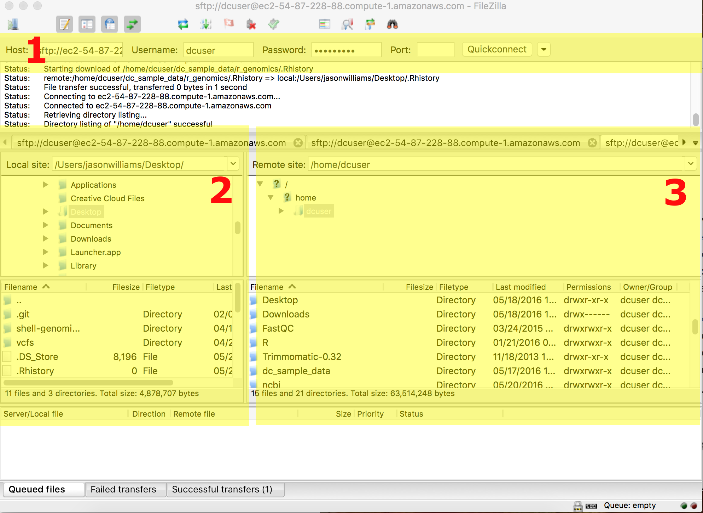

## Learning Objectives

- Be able to import data onto a server:
    - from one server (or your computer) to another server using `scp`  
    - from one server (or your computer) to another server using `rsync`  
    - from an ftp/URL
        - using `wget`
        - using `curl`
    - from SRA
    - from a grid resource (iRODS)
    - Using an FTP client
- Be able to verify file integrity using checksums
- Be able to preview and decompress compressed files

## Lesson

Just like laboratory bench work, a good analysis depends on having the right reagents. Besides the data that you have produced in your experiment, you will also need to have access to reference genomes, annotations, and software. While most reagents may be labeled with expiration dates or lot numbers, your data also need to pass 'smell tests' - some checks you can use to examine and verify data integrity. 

Before you can even get to examine the data you will often have to move it either from your computer or an online database to your cloud instance or HPC server. This is getting easier, but is not guaranteed to be foolproof or fun. The exercises below will explain a few useful methods and show you how to use them. 


> **Tip:** For the purpose of these lessons, we have pretty much staged all the large data files you will need during the workshop. If a link is broken, or or a download does not proceed we should have all the files needed already in place. 


## Exercises 

### Choices, Choices, Choices

According to the learning objectives, we want you to know about 7 methods to transfer data onto your remote server. If you are learning these at the workshop, we will probably only have time to cover 2-3 methods. Please come back and consider/try the rest if these are useful. Please also note, that many of these methods can be used in many more situations that we will cover in these examples. Many of these programs will also have options we will not cover in the workshop so read the man pages, especially when you want to ask the question can program `xxx` do `yyy`? It probably can, check the man page!

#### Important Caveats 
- We will only discuss getting data onto your cloud/HPC server; see the [DATAROUNDTRIPPING LESSON - PLACEHOLDER]()
- Many of the programs covered don't have a simple alternative for PC. Since `scp` is the simplest, we will cover that here. For PC users who must try some of the other programs, [Cygwin](https://www.cygwin.com/) is comprehensive (but not necessarily light-weight) way to use PC friendly alternatives. 


**A. Moving files from your local machine to a remote machine using `scp`**

**Program:** `scp` - [scp man page](http://www.openbsd.org/cgi-bin/man.cgi/OpenBSD-current/man1/scp.1?query=scp&sec=1)

**When to use:** When you have one or a few smaller (<100mb) files to transfer from your computer to a remote machine. 

**Example Usage:** 
```bash
$ scp /dir_on_your_computer/file_on_your_computer.file your_username@remotehost.edu:/remote/directory 
```
>**MAC/Linux vs PC difference:** Since PC has no scp, you can use [PSCP](http://www.chiark.greenend.org.uk/~sgtatham/putty/download.html) following the directions below:

#### PC

Using PC, we recommend you use the *PSCP* program. This program is from the same suite of tools as the putty program we have been using to connect. 

1. If you haven't done so, download pscp from [http://the.earth.li/~sgtatham/putty/latest/x86/pscp.exe](http://the.earth.li/~sgtatham/putty/latest/x86/pscp.exe)
2. Make sure the *PSCP* program is somewhere you know on your computer. In this case, your Downloads folder is appropriate. 
3. Open the windows [PowerShell](https://en.wikipedia.org/wiki/Windows_PowerShell); go to your start menu/search enter the term **'cmd'**; you will be able to start the shell (the shell should start from C:\Users\your-pc-username>). 
4.Change to the download directory
```
> cd Downloads
```
5. locate a file on your computer that you wish to upload (be sure you know the path). Then upload it to your remote machine (**you will need to know your ip address, and login credentials**). You will be prompted to enter a password, and then your upload will begin. **(make sure you use substitute 'your-pc-username' for your actual pc username)**

   ```
C:\User\your-pc-username\Downloads> pscp.exe local_file.txt dcuser@ip.address:/home/dcuser/
```

#### MAC/Linux

1. Open the terminal and use the *scp* command to upload a file (e.g. local_file.txt) to the dcuser home directory:

   ```bash
$  scp local_file.txt dcuser@ip.address:/home/dcuser/
```

---
### `scp` challenge
1. Copy a small text file from your your laptop to your remote machine's home directory. 

---
 
**B. Moving files from your local machine to a remote machine using `rsync`**

**Program:** `rsync` - [rsync man page](http://linuxcommand.org/man_pages/rsync1.html)

**When to use:** When you have large (>100mb)/lots of files to transfer from your computer to a remote machine. `rsync` will compare files and directories and copy only missing or incomplete files.  

**Example Usage:** 
```bash
$ rsync /dir_on_your_computer/file_on_your_computer.file your_username@remotehost.edu:/remote/directory     
```

### `rsync` options

`rsync` has some important options that are too good to skip over:

**`rsync -a`**: The archive option allows you to copy directories (recursively) and preserve special unix filesystem features associated with files (such as modification date, permissions, etc.)

**`rsync -anv`**: In addition to the archive option, adding `n` (dry-run) and `v` (verbose) allows you to preview a list of the files that *would* be transferred   without the `n` option. 

---
### `rsync` challenge
On your local computer choose (or create) a directory with at least one file. Try the following and observe the results assuming your directory and file have the path `/dir/file.file`

1. What is the difference between copying your directory `-anv` options if you use or omit a trailing slash (e.g. copying `rsync -anv /dir` vs. `rsync -anv /dir/`?
2. What does `rsync` do when you use the `-P` option?
3. what does `rsync -c` do?

---

**C. Importing/downloading files from a URL (e.g. ftp) to a remote machine using `curl` or `wget`**

**Program:** 
- `wget` - [wget man page](https://www.gnu.org/software/wget/manual/wget.html)
- `curl` - [curl man page](http://manpages.debian.org/cgi-bin/man.cgi?query=curl&apropos=0&sektion=0&manpath=Debian%20unstable%20sid&format=html&locale=en)

**When to use:**  

`curl` and `wget` are an easy way to import files when you have a URL. These methods generally work, however for really large datasets these methods will be slower (they are done over HTTP like standard webpages). 

**Example Usage:** 

    ```bash
    $  wget ftp://ftp.ncbi.nlm.nih.gov/genbank/README.genbank

    $ curl -o genbankreadme.txt ftp://ftp.ncbi.nlm.nih.gov/genbank/README.genbank
    # -o option allows you to set the filename
    ```

---

**D. Importing files from SRA using SRA Toolkit**

The NCBI [Sequence Read Archive](https://www.ncbi.nlm.nih.gov/sra) is a large repository of high-throughput sequencing read data. As valuable as these data are, it can still be challenging to navigate and import these data. 

**Program:**
You will need to download the [SRA Toolkit](https://www.ncbi.nlm.nih.gov/Traces/sra/?view=software) in order to import data from the SRA. 

**When to use:**

When you want to access any of the sequencing experiment data hosted on SRA. 

**Example Usage:**
Using our workshop cloud computer (a 64-bit ubuntu machine), you could use the following:

```
$ wget http://ftp-trace.ncbi.nlm.nih.gov/sra/sdk/2.6.2/sratoolkit.2.6.2-ubuntu64.tar.gz

# this compressed file must be extracted, e.g.:
# $ tar -xvf sratoolkit.2.6.2-ubuntu64.tar.gz
# individual tools will be in the /bin directory of the extracted folder
# e.g: sratoolkit.2.6.2-ubuntu64/bin
```

The [Toolkit documentation](https://www.ncbi.nlm.nih.gov/Traces/sra/?view=toolkit_doc) list the key functions of the software. Once you have the accession ID, you could download using the 'prefetch' utility:

```
$ ./prefetch -pc SRR390728

# the "./" in front of the prefetch program tells linux to run/execute that program
# the downloaded file will appear in an 'ncbi' folder that will be created in
# your home directory. 
```
The toolkit will also explain the important utilities such as `fasts-dump` which will decompress the .sra file format into a fastq file and the ascp download utility which can help accelerate large downloads. 

---

**E. Importing files from a grid resource (iRODS)**

**Program:** iRODS has become a popular system ([data grid](https://en.wikipedia.org/wiki/Data_grid)) for moving large amounts of data. Using [icommands](irods.org/download/) **(Note: Download only the iCommands CLI)** you can interface with your data grid. 

**When to use:**

If you need to access data available on an iRODS system

**Example Usage:**

This example works with the [CyVerse Data Store](http://www.cyverse.org/data-store), and iRODS system. If you are unfamiliar with iCommands see their [documentation](https://docs.irods.org/master/icommands/user/). This tutorial assumes you have a CyVerse account (See: [CyVerse Website](http://www.cyverse.org/)). 

### Setting up iCommands for CyVerse

1. Initialize iCommands using the following command

   ```bash
$ iinit
```
2. You will then be asked to setup your account and will need to enter the following information

    |Prompt|Entry|
    |------|-----|
    |irodsHost|data.iplantcollaborative.org|
    |port|1247|
    |zone|iplant|
    |irodsUserName|your CyVerse username|
    |Current iRODS password|your CyVerse password|
3. Verify that you have connected to your CyVerse Data Store; view the contents of your home directory using the following the *ils* command:

   ```bash
$ ils
```

#### Moving Data to and from your remote machine to Data Store

##### Move to Data Store
To move data from a local source to CyVerse use the *iput* command. In this case we pass the -P option to see the progress of the transfer. 

```
$ iput -P remote_machine_file.txt .
```
**Tip:** in this case, the '.' stands for the current CyVerse working directory which is by default '/iplant/home/your-iplant-username'

#### Retrieve from Data Store

Use the *iget* command to move files from the Data Store into your remote machine:

```
$ iget -P iplant_datastore_file.txt .
```

There are several other iCommands options (including how to use the -T option for more reliable big data transfers, and -r command for recursive transfers of directories - See [iCommands documentation](https://pods.iplantcollaborative.org/wiki/display/DS/Using+iCommands). 

---

**F. Importing files using and FTP client**

**Program:** FileZilla is one of many free FTP clients that allow you to move files between local and remote locations. You can obtain FileZilla at the [FileZilla Download](https://filezilla-project.org/download.php?show_all=1) page. 

**When to use:**

If you would like a graphical user interface to manage files and folders. 

**Example Usage:**

Instructions here are given for the genomics workshop cloud machines, but the process will be the similar for any remote server. Refer to the screenshot below as you consider the instructions. 

1. Download and install FileZilla
2. Enter the location and user credentials of the remote server you are connecting to (section 1)
    - for host enter the machine IP address
    - enter your dcuser username and the password
    - for port enter 22
3. Files on your local computer will be in the highlighted section 2. 
    - Your Desktop in a folder called 'Users' > 'your computer's username' > and Desktop
4. Files on your remote computer will be in the highlighted section 3. 
    - Your Desktop in a folder called 'Users' > 'your computer's username' > and Desktop
5. Move files between computers by drawing and dropping them in the desired locations. 
    - *Tip:* You can resize windows in FileZilla for easier viewing.  

  

## File Integrity and Compression

### Checksums - md5sum
In addition to understanding how to work with these files, we also need to understand how to verify the integrity of these files. It is not uncommon to download a file, and get error messages, have to restart downloads, move files, etc. In these cases, knowing how to verify that two files are the same (not simply named the same) is very important. To do this we use a process called checksums:

According to [wikipedia](https://en.wikipedia.org/wiki/Checksum) a checksum is 'a small-size datum from a block of digital data for the purpose of detecting errors which may have been introduced during its transmission or storage.'In other words it is a result we can generate that uniquely corresponds to a file. Any change to that file (adding a space, deleting a character, etc.) will change the file's checksum. 

##Exercises 

### A. File integrity - download a reference genome and verify the download 

1. Use ``wget`` to download two 'test' genomes from the following url:

   ```bash
$ wget http://de.iplantcollaborative.org/dl/d/6E4E9943-93F8-4136-86E3-14DA6D1B604F/GCF_000017985.1_ASM1798v1_genomic_2.fna
```
and
   
   ```bash
$ wget http://de.iplantcollaborative.org/dl/d/6E4E9943-93F8-4136-86E3-14DA6D1B604F/GCF_000017985.1_ASM1798v1_genomic_2.fna
```
2. Next for each of the use md5sum and compare the results

   ```bash 
$ md5sum <file>
```

### B. Download a reference genome from Ensembl

1. Visit the Ensembl database at [http://bacteria.ensembl.org/index.html](http://bacteria.ensembl.org/index.html). In the 'Search for a genome' search box search for 'Escherichia coli B str. REL606'; this should bring you to the genome of the strain used in the Lenski experiment ([ensemble direct link](http://bacteria.ensembl.org/escherichia_coli_b_str_rel606/Info/Index))
2. There will be a link '[Download DNA Sequence](ftp://ftp.ensemblgenomes.org/pub/bacteria/release-27/fasta/bacteria_5_collection/escherichia_coli_b_str_rel606/dna/)(FASTA)'. Click on the link an copy the URL from the web browsers navigation/location display (i.e. http://bacteria.ensembl.org/escherichia_coli_b_str_rel606/Info/Index). 
3. Use the ``wget`` command to download the contents of the ftp site (don't forget to use the '*' wildcard to download all files)

   ```bash
$ wget ftp://ftp.ensemblgenomes.org/pub/bacteria/release-27/fasta/bacteria_5_collection/escherichia_coli_b_str_rel606/dna/*
```
You should have downloaded the following files:

   ```
CHECKSUMS
Escherichia_coli_b_str_rel606.GCA_000017985.1.27.dna.chromosome.Chromosome.fa.gz
Escherichia_coli_b_str_rel606.GCA_000017985.1.27.dna.genome.fa.gz
Escherichia_coli_b_str_rel606.GCA_000017985.1.27.dna_rm.chromosome.Chromosome.fa.gz
Escherichia_coli_b_str_rel606.GCA_000017985.1.27.dna_rm.genome.fa.gz
Escherichia_coli_b_str_rel606.GCA_000017985.1.27.dna_rm.toplevel.fa.gz
Escherichia_coli_b_str_rel606.GCA_000017985.1.27.dna_sm.chromosome.Chromosome.fa.gz
Escherichia_coli_b_str_rel606.GCA_000017985.1.27.dna_sm.genome.fa.gz
Escherichia_coli_b_str_rel606.GCA_000017985.1.27.dna_sm.toplevel.fa.gz
Escherichia_coli_b_str_rel606.GCA_000017985.1.27.dna.toplevel.fa.gz
README
```
4. Use the ``less`` command to examine the README file - in particular, look at the <sequence type> definition to understand what the differently zipped files are. 
5. Generate a checksum using the ``sum`` command(``sum`` is used by Enseml and is  an alternative to ``md5sum``) for the **'Escherichia_coli_b_str_rel606.GCA_000017985.1.27.dna.genome.fa.gz'** file and compare with the last few digits of the sum displayed in the CHECKSUMS file. 
6. Preview the first few lines (``head``) of the compressed (gzip'd) reference genome using the ``zcat`` command:

   ```bash
$ zcat Escherichia_coli_b_str_rel606.GCA_000017985.1.27.dna.genome.fa.gz |head
```
7. Finally, unzip the E.coli reference genome, which will be part of the variant calling lesson and place it in your 'data folder' in a new 'ref_genome' folder. 

   ```bash
$ gzip -d Escherichia_coli_b_str_rel606.GCA_000017985.1.27.dna.genome.fa.gz
```
**Tip:** create the 'ref_genome' folder in '~/dc_workshop/data' and use the *cp* command to move the data

